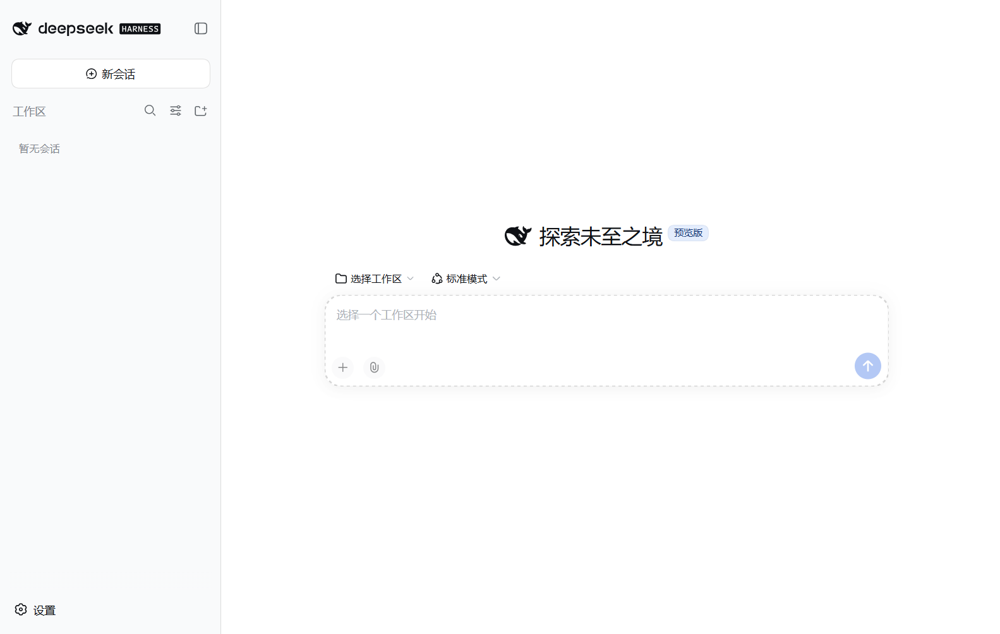
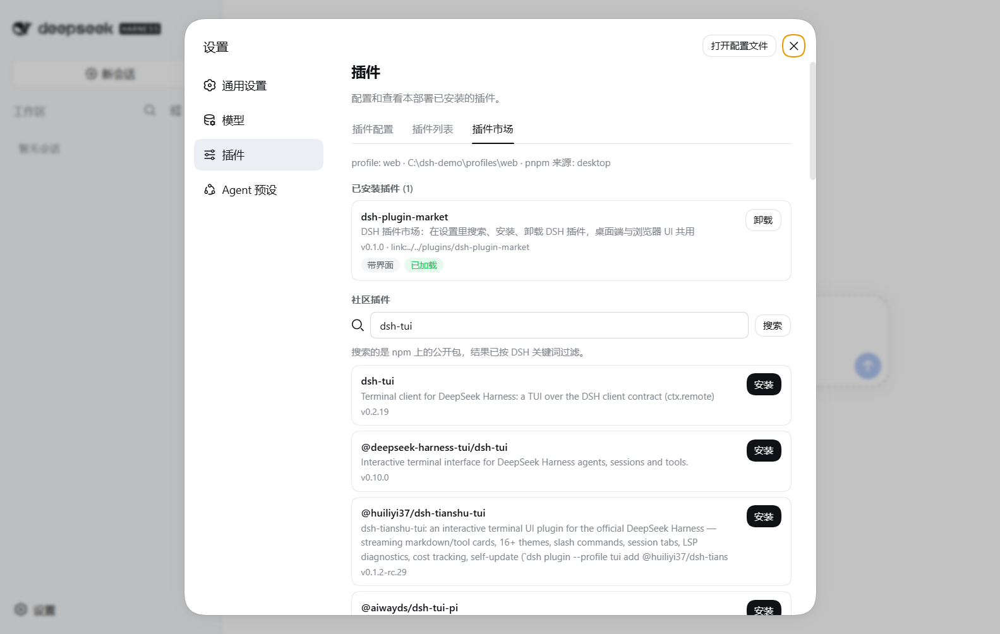

# DSH Desktop

给 [DeepSeek Harness](https://github.com/deepseek-ai/deepseek-harness)（DSH）做的 Windows 桌面端：**双击即可运行**，并自带一个插件市场。



## 特性

- **双击就能跑** —— 不用开终端敲命令，有原生窗口、菜单和图标。
- **和命令行 / 浏览器共用同一份数据** —— 桌面端不复制也不修改 DSH，用的是同一个 `DSH_HOME`。
  会话历史、设置、API Key、插件全部共享，在哪边接着聊都行。
- **自带插件市场** —— 在设置里搜索、安装、卸载 DSH 插件。装好的插件桌面端和浏览器 UI 两边都能用。
- **失败看得见** —— 启动失败时显示一张状态页，列出 DSH_HOME、node、dsh CLI、工作目录和完整日志，
  而不是留一个白屏给你猜。
- **绿色免安装** —— 整个文件夹可以拷到别处或 U 盘，删掉即卸载，不影响 DSH 原有数据。

## 系统要求

DSH Desktop 是一个桌面外壳，启动的是**本机已安装的 DSH**。所以请先准备好：

| 要求 | 说明 |
|---|---|
| 操作系统 | Windows 10 / 11（x64） |
| [Node.js](https://nodejs.org/) | 20 或更高版本（要**从源码构建**的话需要 22.12+，原因见[那一节](#从源码构建)） |
| DeepSeek Harness | 执行 `npm i -g @deepseek-ai/dsh` |
| DeepSeek API Key | 首次启动后在界面里配置 |

装好 Node.js 后可以先验证一下 DSH 本身能不能跑：

```powershell
npm i -g @deepseek-ai/dsh
dsh web
```

能打开 DSH 的网页界面就说明环境没问题，关掉即可。

## 安装

### 方式一：下载现成产物（推荐）

1. 到本仓库的 **Releases** 页面下载 `DSH-Desktop-win32-x64.zip`；
2. 解压到任意目录，例如 `D:\DSH Desktop`；
3. 双击 `DSH Desktop.exe`；
4. 想要桌面快捷方式，双击同目录下的 `创建桌面快捷方式.cmd`。

首次启动会先显示「正在启动 DSH」，几秒后进入 DSH 界面。如果是全新环境（本机还没有 DSH 的
配置目录），桌面端会自动把 profile 初始化出来，这一步只做本地组装，不联网。

### 方式二：从源码构建

见下方「[从源码构建](#从源码构建)」。

## 使用

### 插件市场

**设置 → 插件 → 插件市场**（也可以走菜单 `DSH → 打开插件市场`，或按 `Ctrl+Shift+P`）。



- **已安装插件**：列出当前 profile 的插件依赖、版本、是否已加载，可一键卸载；
- **社区插件**：直接在 npm 上搜索 DSH 相关包（结果按 DSH 关键词过滤），一键安装；
- 安装时会实时显示 pnpm 的输出；装完提示需要重启，点「立即重启」即可。

安装走的是和 `dsh plugin --profile web add <包>` 完全一样的机制——写 profile 的
`package.json` 依赖并同步 `dsh.profile.bundles`。所以用命令行装的插件这里也能看到，反之亦然。

### 菜单

| 菜单项 | 作用 |
|---|---|
| DSH → 打开插件市场 | 跳到「设置 → 插件 → 插件市场」 |
| DSH → 重新加载界面 | 刷新页面 |
| DSH → 在浏览器中打开 | 用系统浏览器打开当前实例 |
| DSH → 重启 DSH 服务 | 装完插件后让它生效 |
| DSH → 选择工作目录… | 改 agent 的 workspace 根目录（默认用户主目录） |
| DSH → 打开日志文件 | 启动出问题时看这里 |
| DSH → 打开 DSH 数据目录 | 打开 `~/.dsh` |
| DSH → 重新安装插件市场插件 | 插件市场丢失或损坏时修复 |
| DSH → 移除插件市场插件 | 从 profile 里干净移除本插件 |
| 视图 → 开发者工具 | 排查界面问题 |

### 数据放在哪

桌面端没有自己的数据目录，一切都在 DSH 的 `~/.dsh` 下：

| 内容 | 位置 |
|---|---|
| 会话历史 | `~/.dsh/sessions` |
| 设置 | `~/.dsh/settings.yaml` |
| API Key | `~/.dsh/.credentials.yaml` |
| 插件 | `~/.dsh/profiles/web` |
| 附件 | `~/.dsh/attachments` |

桌面端自身只记窗口位置和最近的工作目录，放在 `%APPDATA%\DSH Desktop\desktop-state.json`，
日志在同目录的 `logs\dsh-web.log`（超过 2MB 自动轮转）。

> 桌面端会自己拉起一个 DSH 服务进程（随机本机端口，访问 URL 带一次性 token）。
> 如果同时开着 `dsh web`，会有两个进程读写同一个 `DSH_HOME`——数据是同一份，但没必要同时开两个。

## 常见问题

**提示「找不到已安装的 @deepseek-ai/dsh」**
DSH Desktop 只复用本机已有的 DSH，不会自己去装。执行 `npm i -g @deepseek-ai/dsh` 后重试。
如果 DSH 装在非常规位置，可以用 `DSH_CLI` 指向它的 `lib/bin.js`，用 `DSH_NODE_BIN` 指定 `node.exe`。

**插件市场里显示「未找到 pnpm」**
用桌面端启动不会出现这种情况（自带 pnpm）。用 `dsh web` 起的浏览器版本需要装 pnpm
（`npm i -g pnpm`）或启用 corepack（`corepack enable pnpm`）。

**装了插件但界面没变化**
插件是 DSH 启动时按 profile 组装进 loader 的，装完需要重启：菜单 **DSH → 重启 DSH 服务**，
然后按提示刷新页面。

**想完全移除插件市场**
菜单 **DSH → 移除插件市场插件**，或手动删除下面几项：

- `~/.dsh/profiles/web/cordis.patch.yml` 里 `# ── 插件市场` 那段；
- `~/.dsh/profiles/web/package.json` 里的 `dsh-plugin-market` 依赖；
- `~/.dsh/profiles/web/node_modules/dsh-plugin-market`；
- `~/.dsh/plugins/dsh-plugin-market`。

改动前都会留下 `*.dsh-desktop-backup` 备份，可以直接改名还原。桌面端本体删掉
`dist/DSH Desktop` 整个文件夹即可，DSH 数据不受影响。

## 从源码构建

只是想用的话不用看这一节——去 Releases 下载 zip 更省事。下面是给**想自己构建、或者要改代码**的人看的，按顺序做即可。

### 1. 确认环境

| 项目 | 要求 | 说明 |
|---|---|---|
| Windows | 10 / 11（x64） | 目前只构建这一个平台 |
| **Node.js** | **≥ 22.12** | Electron 44 的硬性要求（它的 `package.json` 里写着 `engines.node >= 22.12.0`）。用 `node -v` 确认。注意这比"只运行下载版"的门槛高——那种情况 Node 20 就够 |
| Git | 任意近期版本 | 用来拿代码；也可以直接下载 ZIP，见下一步 |
| DeepSeek Harness | `npm i -g @deepseek-ai/dsh` | 只有 `npm start`（开发模式）需要；单纯 `npm run dist` 打包不需要 |
| 磁盘空间 | **预留约 1 GB** | 依赖约 420 MB + 产物约 390 MB + Electron 下载缓存约 150 MB |

### 2. 获取代码

```powershell
git clone https://github.com/LeeJazen/dsh-desktop.git
cd dsh-desktop
```

不想用 Git 的话，在仓库页面点 **Code → Download ZIP**，解压后进入目录，效果一样。

### 3. 安装依赖

```powershell
npm install
```

这一步做两件事：

1. 从 npm 下载 `electron`、`resedit`、`pnpm` 这些**依赖包**；
2. 通过 `postinstall` 钩子把 **Electron 运行时（约 150 MB）** 下下来并解压到 `node_modules/electron/dist`。

装完之后 `node_modules/` 约 420 MB，耗时主要取决于下载速度。

> **注意**：这一步**不会下载本项目的代码**——代码是上一步 `git clone` 拿到的。
> `npm install` 只装依赖。

国内网络下载 Electron 慢或超时的话，先设镜像再装：

```powershell
$env:ELECTRON_MIRROR="https://npmmirror.com/mirrors/electron/"
npm install
```

### 4. 打包

```powershell
npm run dist
```

产出在 `dist\DSH Desktop\`，双击里面的 `DSH Desktop.exe` 就能运行。

想压成可以直接分发的 zip（和 Release 附件同款）：

```powershell
Compress-Archive -Path "dist\DSH Desktop" -DestinationPath "DSH-Desktop-win32-x64.zip"
```

### 5. 想改代码的话，用开发模式

```powershell
npm start
```

以开发模式直接启动桌面端，改完 `electron/` 下的代码重启即可生效。
桌面端自身状态和日志在 `%APPDATA%\DSH Desktop\`（日志：`logs\dsh-web.log`）。

`plugin-market/lib/client.js`（插件市场的浏览器半边）比较特殊：它是手写的
`window.__ModuleLoader__.load` bundle，不需要构建，但改完要**重启 DSH 服务 + 刷新页面**才会重新加载。

### 各条命令对照表

| 命令 | 联网下载 | 做什么 | 需要先装 DSH |
|---|---|---|---|
| `npm install` | ✅ Electron（约 150 MB）、resedit、pnpm | 装进 `node_modules/`（约 420 MB） | 否 |
| `npm run dist` | ❌ | 打包出 `dist\DSH Desktop` | 否 |
| `npm start` | ❌ | 开发模式直接跑桌面端 | **是** |
| `npm run icon` | ❌ | 用 DSH 自带的 sharp 重新生成 `build/icon.ico` | **是** |
| `npm run shortcut` | ❌ | 在桌面创建快捷方式 | 否 |

**只想拿到 exe、不改代码**，两条就够：

```powershell
npm install
npm run dist
```

> CI 用的是 `npm ci`（严格按 `package-lock.json` 装、会先删掉 `node_modules`），
> 日常开发用 `npm install` 就行。如果你改了依赖，记得把更新后的 `package-lock.json` 一起提交，
> 否则 CI 会失败。

### 常见构建问题

| 现象 | 原因与处理 |
|---|---|
| `npm install` 卡在下载 Electron / 超时 | 设 `ELECTRON_MIRROR` 后重试（见第 3 步）。实在不行可以在有网的机器上装好，再把整个目录拷过来 |
| 报错 `✗ 打包失败，阶段：「检查 Electron 运行时」` | Electron 运行时没下下来。手动补一次：`node tools/ensure-electron.mjs`，然后重新 `npm run dist` |
| 打包报错里带「阶段：xxx」 | 打包脚本会把失败的阶段和环境自检一起打出来，照那几行看就能定位 |
| `npm start` 打开的是「DSH 没能启动」状态页 | 桌面端没找到本机的 DSH。先 `npm i -g @deepseek-ai/dsh`；装在非常规位置就用 `DSH_CLI`（指向 `lib/bin.js`）和 `DSH_NODE_BIN`（指向 `node.exe`）指路 |
| `npm run icon` 报找不到 sharp | 这个命令借用 DSH 自带的 sharp，要先装 DSH。`build/icon.ico` 仓库里已经有了，不改图标就不用跑它 |
| 启动时报 `EPERM` / 命名管道相关错误 | Electron 要建进程间管道，别在严格沙箱化的终端里跑（部分安全软件的沙箱、受限容器都会拦） |
| 杀毒软件报毒 / 打包很慢 | 产物约 390 MB、解压后有上千个文件，实时扫描会明显拖慢进度 |

### 验证构建产物

仓库自带一个截图 / 诊断工具，会启动桌面端、等页面稳定后截图，并把桌面端的最近日志打出来：

```powershell
node tools/verify/capture.mjs --market      # 打开插件市场并截图
node tools/verify/capture.mjs               # 主界面截图
node tools/verify/capture.mjs --dev         # 验证开发模式（用 node_modules 里的 electron）
node tools/verify/capture.mjs --out shot.png --delay 15000   # 自定输出与等待时间
```

### 调试用环境变量

| 变量 | 作用 |
|---|---|
| `ELECTRON_MIRROR` | 换 Electron 运行时的下载源（国内建议 npmmirror） |
| `DSH_DESKTOP_NO_PROVISION=1` | 启动时不把插件市场装进 profile |
| `DSH_DESKTOP_USER_DATA=<dir>` | 改桌面端自身状态目录（便携模式 / 测试） |
| `DSH_DESKTOP_CAPTURE=<png>` | 验证钩子：等页面稳定后截图并退出 |
| `DSH_DESKTOP_CAPTURE_SCRIPT=<js>` | 截图前先执行一段页面脚本 |
| `DSH_CLI` / `DSH_NODE_BIN` | 手动指定 DSH 入口 / node.exe |

## 目录结构

```
.
├─ electron/                  桌面端主进程
│   ├─ main.js                窗口、菜单、子进程管理、启动 URL 捕获、状态页
│   ├─ preload.js             只给状态页用的最小 IPC 桥
│   ├─ loading.html / error.html / status.css / status.js
│   └─ lib/
│       ├─ locate.js          定位 node / dsh CLI / pnpm / DSH_HOME
│       ├─ dsh-server.js      托管 `dsh --profile web` 子进程并解析启动 URL
│       └─ provision.js       把插件市场幂等装进 profile（含备份与指纹同步）
├─ plugin-market/             「插件市场」DSH 插件（宿主 + 浏览器两半，无构建步骤）
├─ tools/
│   ├─ make-icon.mjs          生成 build/icon.ico
│   ├─ build-app.mjs          打包绿色版（拷 Electron 运行时 + resedit 写图标/版本）
│   ├─ create-shortcut.ps1    创建桌面快捷方式
│   └─ verify/                自动化验证工具与注入脚本
├─ build/icon.ico             应用图标
├─ docs/                      截图与发布说明
└─ .github/workflows/         CI：构建并发布 Release 附件
```

## 实现要点

- **为什么要抓启动 URL**：DSH Web UI 每个进程都会生成一次性 token，只有启动时打印的那行
  `dsh web: http://127.0.0.1:<port>/?token=...` 能换到签名 cookie。桌面端因此监听子进程输出、
  解析这行 URL 再加载进窗口，而不是自己拼地址。
- **为什么用系统的 node**：DSH 依赖按 Node ABI 编译的原生模块（sharp / node-pty 等），
  Electron 自带的 Node ABI 不兼容，所以子进程用真正的 `node.exe`。
- **插件市场的通信方式**：走 `dsh-host-webserver` 上的同源 HTTP 路由（`/plugin-market/*`），
  而不是 Typert Remote——安装是长任务，需要流式回传 pnpm 日志。路由只接受 loopback + 同源请求，
  判据与 `/api` 的浏览器信任栅栏一致。
- **插件怎么分发**：源码放 `~/.dsh/plugins/dsh-plugin-market`，在 profile 的 `node_modules` 下挂
  junction（与 DSH 自己的 hoisted 布局一致），再往 `cordis.patch.yml` 插一行 loader entry。
  按内容指纹判断是否需要重写，改了代码没改版本号也能同步。
- **打包不使用 electron-builder / @electron/packager**：前者需要 NSIS / winCodeSign 工具链；
  后者每次都要联网校验运行时压缩包，网络一抖就卡住。现在直接拷 `node_modules/electron/dist`，
  用 `resedit` 写图标与版本信息，几十行搞定且离线可重复。

## 已知限制

- 目前只构建 **win32-x64**；换平台需要准备对应的 Electron 运行时并调整 `tools/build-app.mjs`。
- 安装 / 卸载插件后需要**重启 DSH 服务**才生效（profile 的 bundle 列表是启动时读取的）。
- 社区插件搜索依赖 npm registry，离线时只有「已安装」列表可用。
- 首次启动若 DSH 正在做 profile 初始化，可能要等十几秒；超过 3 分钟会报错并给出日志。

## 许可

[MIT](LICENSE)。应用图标里的鲸鱼标志取自 DeepSeek Harness 官方前端自带的 `favicon.svg`（MIT），
仅用于标识这是一个 DSH 的桌面外壳，**不代表 DeepSeek 官方发布**。
打包产物内含 Electron 运行时，其许可证全文见产物目录下的 `LICENSE` 与 `LICENSES.chromium.html`。

发布流程（打 tag、CI、Release 附件）见 [docs/RELEASING.md](docs/RELEASING.md)。
